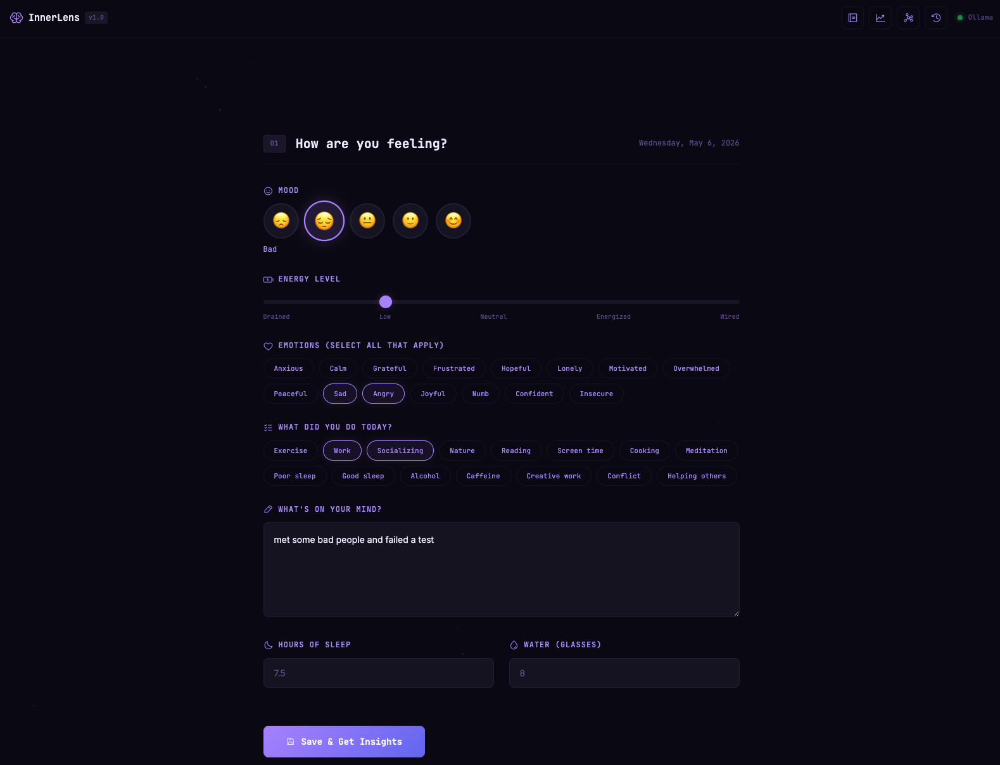

<div align="center">

# InnerLens

**AI Mood Journal — Understand Your Inner World**

A private journal that goes beyond logging. It helps you see emotional patterns, understand what drives your days, and unlock self-awareness through AI-powered reflection.

<br/>



</div>

---

## What Makes This Different

This isn't a notes app with a mood picker. InnerLens uses local AI to:

- **Reflect back** what you're feeling in a way that validates and deepens understanding
- **Spot patterns** you can't see yourself — sleep→mood links, activity correlations, emotional cycles
- **Ask the right questions** — prompts that help you go deeper, not just log and forget
- **Track holistically** — mood, energy, emotions, habits, sleep, hydration, free-form writing

---

## Features

| Feature | Description |
|---------|-------------|
| **Mood + Energy tracking** | 5-point scale with emoji faces and energy slider |
| **Emotion tagging** | 15 granular emotions — anxious, numb, hopeful, insecure, etc. |
| **Activity logging** | Exercise, socializing, screen time, meditation, conflict, etc. |
| **Free-form journaling** | Write as much or as little as you want |
| **Sleep & hydration** | Track hours and glasses |
| **AI Emotional Reflection** | Warm, specific insights on each entry |
| **Pattern Analysis** | Correlations across 30+ days of data |
| **Mood Timeline** | Visual history of your emotional trajectory |
| **Journal History** | Browse all past entries |
| **100% Private** | Everything in localStorage + local Ollama. Nothing leaves your machine. |

---

## Quick Start

```bash
# 1. Make sure Ollama is running
ollama serve

# 2. Serve the app
python3 -m http.server 8080

# 3. Open
open http://localhost:8080
```

---

## Architecture

```
js/
├── app.js              ← Bootstrap
├── core/
│   ├── state.js        ← Global state
│   ├── ollama.js       ← AI communication
│   └── utils.js        ← Helpers, storage
├── ui/
│   ├── particles.js    ← Background
│   └── typewriter.js   ← Terminal effect
└── features/
    ├── journal.js      ← Entry form & saving
    ├── insights.js     ← AI emotional reflection
    ├── patterns.js     ← Long-term analysis
    └── history.js      ← Past entries view
```

---

## The AI Approach

Each entry triggers a reflection prompt that:
1. Validates the emotional experience (not dismissive, not preachy)
2. Connects mood to specific activities, sleep, and context
3. Identifies hidden patterns across recent entries
4. Offers one gentle, concrete suggestion
5. Asks a question that invites deeper self-reflection

Pattern analysis looks at 30 days of data to find:
- Activity-mood correlations
- Sleep impact on next-day energy
- Recurring emotional cycles
- Blind spots in routine

---

*No accounts. No cloud. No tracking. Just you and your thoughts.*
